# Palette-based Photo Recoloring

[Demo](https://recolor.cs.princeton.edu/demo/index.html)

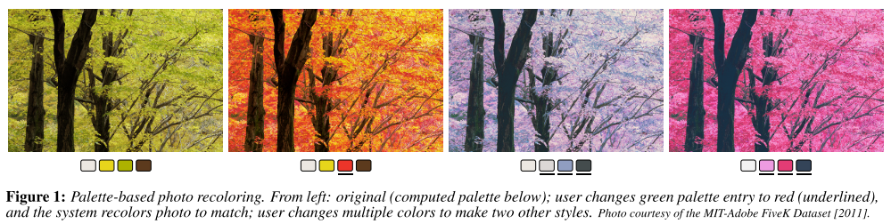

本文介绍了一个简单、直观和交互式的工具，允许非专业人士通过编辑**调色板**来重新为图像上色。

## 1. Introduction

本文的方法既指定了要操纵的颜色，又通过**调色板**指定了对这些颜色的修改——一小组用于==消化==`digest `图像中所有颜色的颜色。

给定一个图像，我们生成一个合适的调色板。然后，用户可以通过修改调色板中的颜色来修改图像（图1:arrow_up:）。图像会全局更改，以使**选定的颜色**精确插入，并通过==径向基函数==表示出色彩空间中的平滑衰减。这些操作在**LAB颜色空间**中执行，以提供衰减的**感知均匀性**。

这种简单应用通常会导致几种`artifacts`。首先，某些像素可能会超出色域。简单地`clamp`色域上可能会导致失去**颜色梯度**。因此，我们在色彩空间中制定了**径向衰减**，以便将色彩朝**色域边界**挤压。其次，许多自然的调色板修改将引起令人不愉快的**视觉伪像**，其中不同像素的**相对亮度被反转**。因此，本文的色彩转移功能与UI功能紧密结合，共同确保了亮度变化的单调性。

## 2. Approach

### User interface

本文描述了一个基于**调色板**的**GUI**，如图2:arrow_down:所示。当照片加载到应用程序中时，会自动生成一个**调色板**。用户只需要点击一个调色板颜色(C)，并通过**HSL颜色选择器**将其更改为$C^/$。

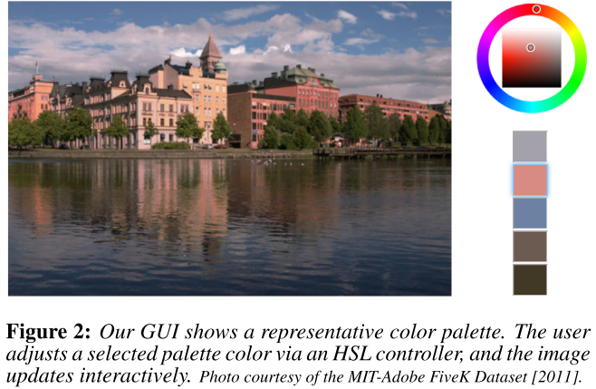

### Automatic Palette Selection

本节介绍使用==k-means算法==的一种变体，基于图像自动创建**调色板**的方法。作者的目标是选择一组k个颜色$\{C_i\}$，提取图像中的主要颜色组，在编辑过程中用作“==控件==”。**k的选择**很重要，通常取决于图像以及用户想要的修改，默认是5，但用户可以自己选择k的值。

在**k-means**对图像颜色的简单应用中，算法的每次**迭代**都涉及图像中的每个像素，这对于大型图像来说代价很高。利用数据限制在==R,G,B∈[0，1]==这一特性，本文将它们分配到**b×b×b**直方图的==bins==中（使用b=16）。对于每个bin，我们计算**Lab**空间中的平均颜色，这些$b^3$的颜色$c_i$（或更少，因为一些bin可能是空的）是我们用于**k-means**的数据——通常至少比图像中的像素数小几个数量级，现在独立于图像大小。

> Lab色彩空间（英语：**Lab color space**）是颜色-对立空间，带有维度**L**表示亮度，**a**和**b**表示颜色对立维度，基于了非线性压缩的CIE XYZ色彩空间坐标。**Lab色彩空间**（英语：**Lab color space**）是颜色-对立空间，带有维度**L**表示亮度，**a**和**b**表示颜色对立维度，基于了非线性压缩的CIE XYZ色彩空间坐标。:star:
>
> 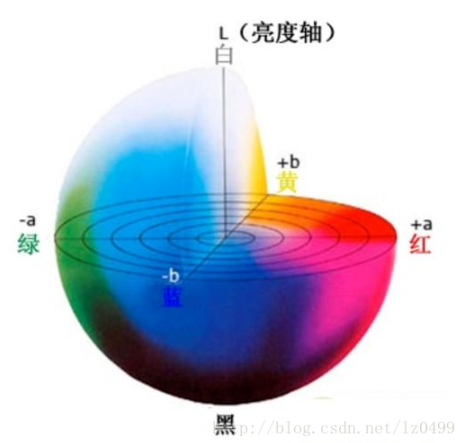
>
> 
>
> 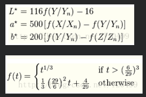

为了解决问题：基本算法随机选取数据点对均值进行初始化，算法的收敛性对该初始化非常敏感。按以下方式初始化**平均值**：

- 初始化第一个平均值，为**权重$n_i$最大**的bin的颜色$c_i$。
- 将所有其他权重$n_j$，按照系数$(1-exp(-d_{ij}^2/\sigma_a^2))$衰减，其中，$d_{ij}$是**Lab空间**中从$c_i$到$c_j$的距离，$\sigma_a$表示落差`falloff`（本文使用$\sigma_a$=80，即从黑到白距离的80%，发现**算法对这个参数相对不敏感**）
- 选择剩余权重$n_i$最高的bin，重复这个过程，直到选择了k个初始means。
- 这种方法是确定性的，会有很大的聚类，彼此之间的距离很远。

最后，作者观察到，基于**像素颜色聚类**选择**调色板**通常会导致一个非常暗(接近黑色)的调色板入口，因为通常有相当数量的图像像素是暗的。而编辑**暗调色板条目**对用户来说效果不明显，因为暗色很难区分（不管色调和饱和度如何）。因此，作者实际上计算(k + 1)个均值，**其中一个初始化并永久锁定为黑色**。图像中最暗的颜色将被分配到这个平均值。计算完成后，丢弃黑色条目，留下k个调色板颜色。

### Color Transfer Goals

现在我们有了一组调色板$\{C_i\}$，需要一个转移函数f来调整到$\{C_i^/\}$，一些关键目标：

- Interpolation：原始图像中，任何与原始调色板颜色$C_i$相同的像素，都应该按照用户改变调色板颜色的方式进行转换：$f(C_i)=C_i^/$。
- In Gamut：色域应该保持不变，$G:f(p\in G)\in G$
- Pixel Continuity：$lim_{q\rightarrow p}f(q)=f(p)$
- Palette Continuity：$lim_{\overline{C}\rightarrow C^/}f_{\overline{C}}(p)=f_{C^/}(p)$
- One-to-One：$f(p)=f(q)\rightarrow p=q$
- Monotonicity in L（亮度L中的单调性）：$L(p)<L(q)\rightarrow L(f(p))<=L(f(q))$
- Dynamic Range：输入中的梯度映射到输出中的梯度（不是单一的值）。例如，如果一个算法将所有颜色均匀地转移到某个方向，然后紧缩到色域，那么根据这个标准，这个算法就是坏的。

旧有方法很难同时满足上诉条件。更糟糕的是，**需求本身**是不一致的。例如，不能同时满足**内插**和**单调性**的要求。如果用户改变了两个调色板颜色的相对亮度，在结果图像中插入这些颜色将违反单调性要求。然而，作者希望在可能的情况下满足这些要求，下面的部分将直接讨论单调性问题。

### Monotonic Luminance Tansfer（单调亮度转移）

本文的应用程序通过两种机制保持亮度的单调性，一种在GUI中，一种在传递函数中。

首先，GUI约束了被编辑颜色$C_i^/$的亮度$L_i^/$的**相对顺序**（如果$i<j$，那么$L_i<L_j$） 。每当用户修改$C_i^/$，GUI会保持$L^/_{j>i}=max(\overline{L}_j^/,L^/_{j-1})$（第一项是修改前的亮度）。要更改**调色板条目**的亮度，我们只需修改Lab空间中的**L通道**。这个操作是按照递增的顺序计算的。

我们处理亮度的第二个方面是，我们设计了一个具有两个**正交分量**的传递函数——$f_L$（基于**调色板亮度**修改**像素亮度**）和$f_{ab}$（修改相应的ab值，将在下一节中讨论）。==亮度传递函数==接受两个最近的**调色板条目**的加权组合（或者一个最近的条目，如果像素比所有调色板条目更暗或更亮，则为黑色或白色)。

在亮度方面，这==两种策略==共同保证了插值和单调性要求，以及其他一些要求（在色域内和两个连续性要求）得到满足。然而，这种方法可能会违反一对一和动态范围的要求。然而，我们通过实验发现，这些原则没有**插值**和**单调性**那么重要。

### Color Transfer (ab)

在上一节中，

我们设计了一个简单的**亮度传递函数**$f_L$，它根据**调色板**的亮度来调整像素的亮度。在这一节中，我们将介绍一个更复杂的传递函数$f_{ab}$，它在ab通道中扮演类似的角色。这个函数的设计不是基于==单调性==的考虑，而是针对其他需求。

首先，我们为一个简单的情况设计函数$f_1$，其中==原始调色板==包含一个颜色C，用户将它修改为颜色$C^/$。对于任何颜色x来说，满足$x^/=f_1(x)$，一个原始的方法是附加偏移$(C^/-C)$到x上，但这无法保持色域，简单使用`Clamp`也会违反一对一和动态范围规则，如下图。

相反，作者设计了一个方案，将**远离色域边界**的颜色转化，但将**靠近边界**的值向边界，向$C^/$挤压：

- 首先，找到$C_b$，向量$C_iC_i^/$和色域边界的交点。

- 然后，判断$x_o=x+C^/-C$是否在色域内

- far case：如果在， 则由x引出的平行线和色域边界相交，确定$x_b$

- near case：如果不在，则由向量$C^/ x_o$和色域的交点确定$x_b$

- 最后，在直线$x x_b$上确定$f_1(x)=x^/$，满足：

    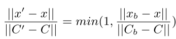

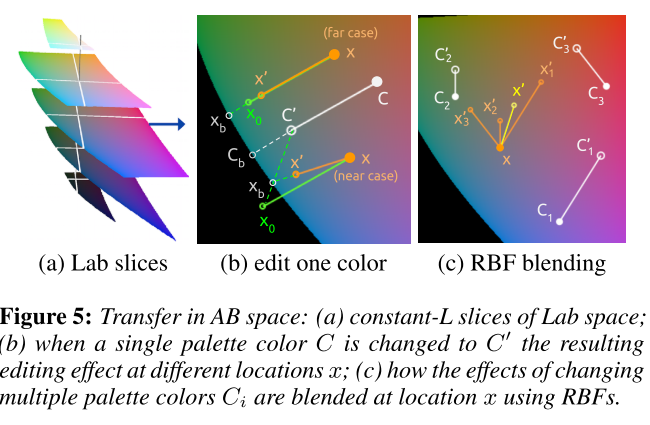

扩展到一般情况，本文的==策略==是：定义k个**传递函数**$f_i(x)$，每个函数都相当于上面描述的$f_1(x)$，就像它是唯一的**调色板条目**一样，然后通过**邻近性加权**混合它们：

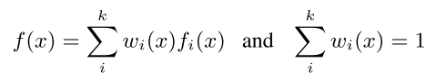

对于权重，我们使用**径向基函数**(==RBFs==)：

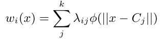

作者尝试了各种核函数，发现==高斯核==表现很好：

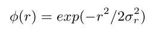

其中，==标量参数==σr定义为：原始调色板中所有颜色对之间的**平均距离**。通过求解$k^2$方程组，可以得到$\lambda_{ij}$，这个方程组是：
$$
w_i(C_j)=\begin{cases} 
1,i=j\\
0,i\neq j
\end{cases}
$$
该方法可以实现在$c_i$点，对传递函数$f_i$的平滑插值。然鹅，求解==RBFs==建立的方程组会导致==负权重==。因此，我们使用了一个简单的修正方法——将任何负权值锁定为零，并对非零权值进行**归一化**。我们发现这种解决方案在实践中很有效。

### Acceleration

第3.5节中描述的==RBF插值方案==相对较快，但它在图像上的应用比较简单，需要对图像中的每一种独特颜色(通常以百万计)进行这种计算。本节描述一个加速方案，该方案可在交互式应用程序中使用。

- 首先，注意**权重**$w_i(x)$仅基于**颜色**x和**初始调色板颜色**$c_i$找到。因此，原则上**RBF计算**只在初始调色板建立时才需要执行（而不是在调色板编辑期间）。
- 使用预计算的权重，在编辑时计算$g^3$中每个位置的f(x)。
- 最后，对于每个像素，使用周围的8个f(x)，进行三线性插值。

实际使用情况来看，$g=12$和$g=64$在视觉效果上差别不大，所以我们可以不用划分的太细。

## 3. Evaluation

### Other Recoloring Methods

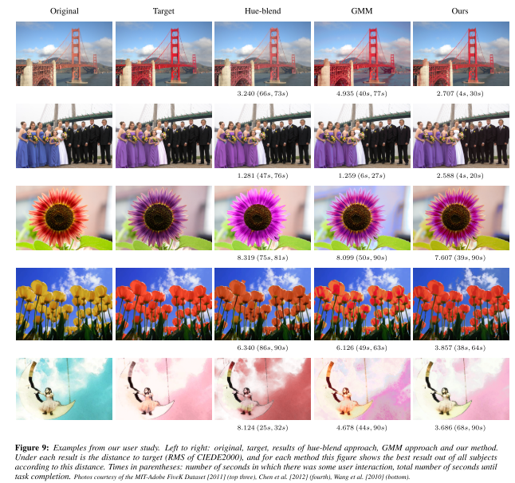

### User Study

评估一项与个人品味有关的任务总是具有挑战性的。在这里，我们描述了一项用户研究，表明我们的方法很容易被非专业人士学习，足够快，足够表达产生各种各样的图像。

为了判断表现力，我们给用户的任务是一个匹配任务：给他们一个目标图像（通过操作原始图像的颜色来创建），然后要求用户使用我们的方法和其他两种方法来操作原始图像来匹配目标图像。这样我们就可以判断我们的方法是否能达到理想的效果谱，并可以用其他方法作为基线比较。

具体见论文。

## 4. Results

### Duotone

==双色调复制==是一种传统的印刷技术，通常涉及两种颜色的油墨，通过**半色调模式**应用在白纸上。这种风格给人一种整体的色彩感觉，具有怀旧的品质。数字成像软件如**Photoshop**提供了双色调功能来产生这种效果，同时允许用户选择油墨颜色。我们的方法很容易产生如下类似的效果。我们从一个灰度图像（或去饱和一个彩色图）开始。我们选择一个三色调色板，并强制其中一种颜色为白色(纸)，让3.2节的自动算法选择另外两种调色板颜色。最后，用户可以调整两个较暗(墨水)调色板的颜色，以实现多种风格的双色图像。图12显示了一个示例。

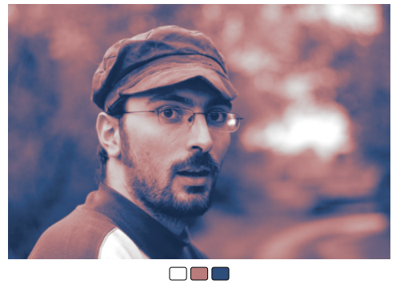

### Automatic Color Manipulation

见论文。

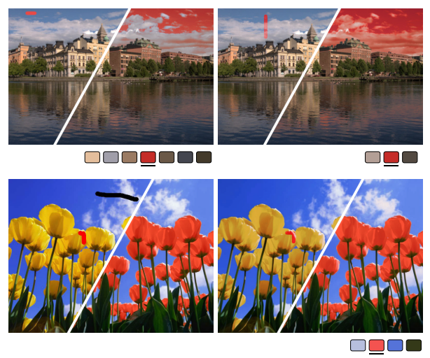